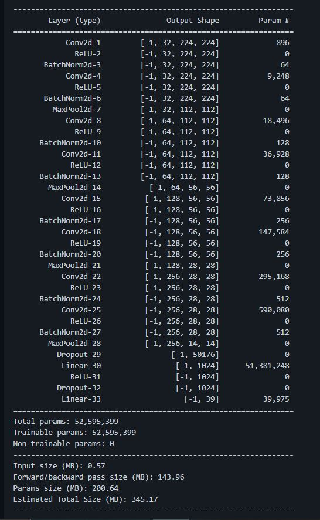

# 🌟Model Architecture :

## 🌟NOTE :-
* If pdf or ipython notebook will not load then please check markdown filde (.md)
* Download the `plant_disease_model_1_latest.pt` file from [Here](https://drive.google.com/file/d/1VowRxSkoRXXkOD07uBc-8uPY6sWvWiHY/view?usp=sharing)

## 🌟Blog Link ( Dataset link is in blog ):
<a href="https://medium.com/analytics-vidhya/plant-disease-detection-using-convolutional-neural-networks-and-pytorch-87c00c54c88f" target="_blank">Plant Disease Detection using Convolutional Neural Network with PyTorch Implementation</a>
